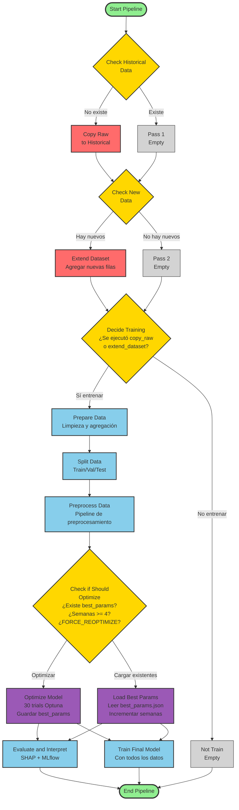
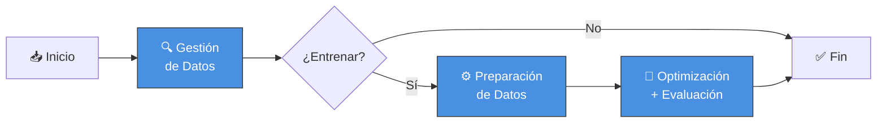

# Diagrama de Flujo - Pipeline de Predicción de Productos Prioritarios

## Diagrama Principal



## Leyenda de Colores

- 🟢 **Verde**: Inicio y fin del pipeline
- 🟡 **Amarillo**: Puntos de decisión (branching)
- 🔵 **Azul**: Tareas de procesamiento y modelado
- ⚪ **Gris**: Operadores vacíos (pass)
- 🔴 **Rojo**: Tareas críticas de datos (copy_raw, extend_dataset)
- 🟣 **Morado**: Optimización inteligente (optimize_model, load_best_params)

## Flujos Posibles

### Escenario 1: Primera Ejecución (sin best_params.json)
```
Start → Check Historical (no existe) → Copy Raw → Check New (no hay) →
Pass 2 → Decide Training (sí) → Prepare Data → Split → Preprocess →
Check Optimize (no existe params) → Optimize Model (30 trials) →
[Evaluate + Train Final] → End
```
**Tiempo**: ~15-20 minutos (optimización completa)

### Escenario 2: Reentrenamiento con Datos Nuevos (semanas < 4)
```
Start → Check Historical (existe) → Pass 1 → Check New (hay nuevos) →
Extend Dataset → Decide Training (sí) → Prepare Data → Split → Preprocess →
Check Optimize (params existen, semanas < 4) → Load Best Params →
[Evaluate + Train Final] → End
```
**Tiempo**: ~2-5 minutos (carga params, solo entrenamiento)

### Escenario 3: Ejecución sin Datos Nuevos
```
Start → Check Historical (existe) → Pass 1 → Check New (no hay) →
Pass 2 → Decide Training (no) → Not Train → End
```
**Tiempo**: ~10 segundos (solo verificaciones)

### Escenario 4: Re-optimización Periódica (semanas >= 4)
```
Start → Check Historical (existe) → Pass 1 → Check New (hay nuevos) →
Extend Dataset → Decide Training (sí) → Prepare Data → Split → Preprocess →
Check Optimize (semanas >= 4) → Optimize Model (30 trials) →
[Evaluate + Train Final] → End
```
**Tiempo**: ~15-20 minutos (re-optimización completa)

### Escenario 5: Re-optimización Forzada (FORCE_REOPTIMIZE=true)
```
Start → Check Historical (existe) → Pass 1 → Check New (puede o no haber) →
[Extend Dataset o Pass 2] → Decide Training (sí) → Prepare Data → Split → Preprocess →
Check Optimize (FORCE_REOPTIMIZE) → Optimize Model (30 trials) →
[Evaluate + Train Final] → End
```
**Tiempo**: ~15-20 minutos (re-optimización forzada)

## Puntos Clave del Diseño

1. **Cuatro decisiones principales**:
   - ¿Existe dataset histórico? (primera vez vs. ejecuciones posteriores)
   - ¿Hay datos nuevos? (reentrenamiento necesario)
   - ¿Entrenar modelo? (basado en las dos decisiones anteriores)
   - ¿Optimizar hiperparámetros? (nueva lógica inteligente para reducir tiempo)

2. **Optimización Inteligente** (NUEVA):
   - **Primera ejecución**: Optimiza con 30 trials y guarda `best_hyperparameters.json`
   - **Reentrenamientos regulares**: Carga params existentes (ahorro de ~10-15 minutos)
   - **Re-optimización periódica**: Cada 4 semanas se re-optimizan los hiperparámetros
   - **Re-optimización forzada**: Variable `FORCE_REOPTIMIZE=true` fuerza optimización
   - **Contador de semanas**: Se incrementa en cada ejecución que carga params

3. **Paralelización**:
   - `evaluate_and_interpret` y `train_final_model` se ejecutan en paralelo
   - Usando `cross_downstream` después de `optimize_model` o `load_best_params`

4. **Predicciones on-demand**:
   - Las predicciones se generan a través de la aplicación web, no en el DAG
   - El DAG se enfoca exclusivamente en entrenamiento y reentrenamiento del modelo

5. **Trigger Rules**:
   - `decide_training` usa `none_failed` para ejecutarse si cualquier rama upstream tuvo éxito
   - `evaluate_and_interpret` y `train_final_model` usan `none_failed` para ejecutarse después de cualquier rama
   - `end_pipeline` también usa `none_failed` para ejecutarse siempre
```

---

## Diagrama Simplificado (Alto Nivel)


