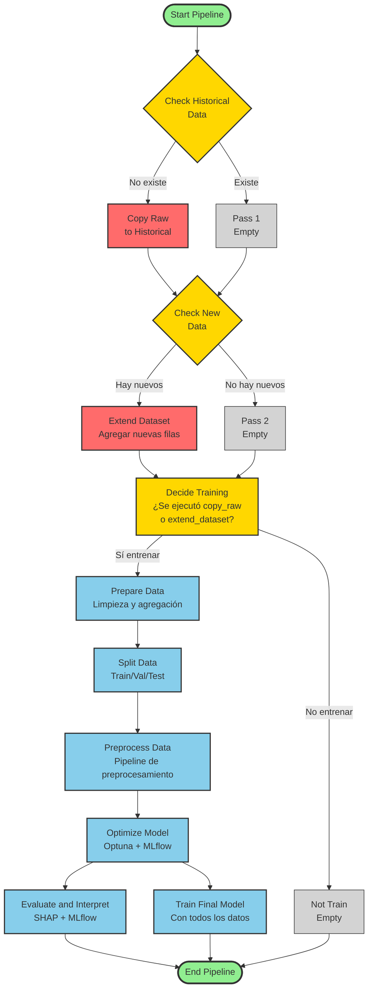
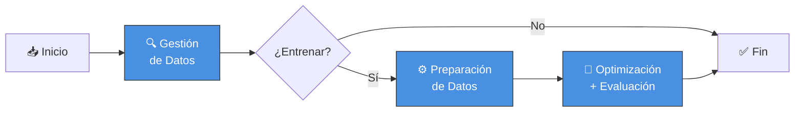

# Diagrama de Flujo - Pipeline de Predicción de Productos Prioritarios

## Diagrama Principal



## Leyenda de Colores

- 🟢 **Verde**: Inicio y fin del pipeline
- 🟡 **Amarillo**: Puntos de decisión (branching)
- 🔵 **Azul**: Tareas de procesamiento y modelado
- ⚪ **Gris**: Operadores vacíos (pass)
- 🔴 **Rojo**: Tareas críticas de datos (copy_raw, extend_dataset)

## Flujos Posibles

### Escenario 1: Primera Ejecución
```
Start → Check Historical (no existe) → Copy Raw → Check New (no hay) →
Pass 2 → Decide Training (sí) → Prepare Data → Split → Preprocess →
Optimize → [Evaluate + Train Final] → End
```

### Escenario 2: Ejecución Regular con Datos Nuevos
```
Start → Check Historical (existe) → Pass 1 → Check New (hay nuevos) →
Extend Dataset → Decide Training (sí) → Prepare Data → Split → Preprocess →
Optimize → [Evaluate + Train Final] → End
```

### Escenario 3: Ejecución Regular sin Datos Nuevos
```
Start → Check Historical (existe) → Pass 1 → Check New (no hay) →
Pass 2 → Decide Training (no) → Not Train → End
```

## Puntos Clave del Diseño

1. **Tres decisiones principales**:
   - ¿Existe dataset histórico? (primera vez vs. ejecuciones posteriores)
   - ¿Hay datos nuevos? (reentrenamiento necesario)
   - ¿Entrenar modelo? (basado en las dos decisiones anteriores)

2. **Paralelización**:
   - `evaluate_and_interpret` y `train_final_model` se ejecutan en paralelo después de `optimize_model`

3. **Predicciones on-demand**:
   - Las predicciones se generan a través de la aplicación web, no en el DAG
   - El DAG se enfoca exclusivamente en entrenamiento y reentrenamiento del modelo

4. **Trigger Rules**:
   - `decide_training` usa `none_failed` para ejecutarse si cualquier rama upstream tuvo éxito
   - `end_pipeline` también usa `none_failed` para ejecutarse siempre
```

---

## Diagrama Simplificado (Alto Nivel)


