# Diagrama de Flujo - Pipeline de Predicción de Productos Prioritarios

## Diagrama Principal

```mermaid
flowchart TD
    Start([Start Pipeline]) --> CheckHist{Check Historical<br/>Data}

    %% Primera bifurcación: ¿Existe histórico?
    CheckHist -->|No existe| CopyRaw[Copy Raw<br/>to Historical]
    CheckHist -->|Existe| Pass1[Pass 1<br/>Empty]

    %% Ambas ramas convergen
    CopyRaw --> CheckNew{Check New<br/>Data}
    Pass1 --> CheckNew

    %% Segunda bifurcación: ¿Hay datos nuevos?
    CheckNew -->|Hay nuevos| ExtendDS[Extend Dataset<br/>Agregar nuevas filas]
    CheckNew -->|No hay nuevos| Pass2[Pass 2<br/>Empty]

    %% Ambas ramas convergen
    ExtendDS --> DecideTrain{Decide Training<br/>¿Se ejecutó copy_raw<br/>o extend_dataset?}
    Pass2 --> DecideTrain

    %% Tercera bifurcación: ¿Entrenar modelo?
    DecideTrain -->|Sí entrenar| PrepData[Prepare Data<br/>Limpieza y agregación]
    DecideTrain -->|No entrenar| NotTrain[Not Train<br/>Empty]

    %% Flujo de entrenamiento
    PrepData --> Split[Split Data<br/>Train/Val/Test]
    Split --> Preproc[Preprocess Data<br/>Pipeline de preprocesamiento]

    %% Cuarta bifurcación: ¿Optimizar hiperparámetros?
    Preproc --> CheckOptimize{Check if Should<br/>Optimize<br/>¿Existe best_params?<br/>¿Semanas >= 4?<br/>¿FORCE_REOPTIMIZE?}
    CheckOptimize -->|Optimizar| Optimize[Optimize Model<br/>30 trials Optuna<br/>Guardar best_params]
    CheckOptimize -->|Cargar existentes| LoadParams[Load Best Params<br/>Leer best_params.json<br/>Incrementar semanas]

    %% Bifurcación en paralelo (cross_downstream)
    Optimize --> Evaluate[Evaluate and Interpret<br/>SHAP + MLflow]
    Optimize --> TrainFinal[Train Final Model<br/>Con todos los datos]
    LoadParams --> Evaluate
    LoadParams --> TrainFinal

    %% Convergencia final
    Evaluate --> End([End Pipeline])
    TrainFinal --> End
    NotTrain --> End

    %% Estilos
    classDef startEnd fill:#90EE90,stroke:#333,stroke-width:3px
    classDef decision fill:#FFD700,stroke:#333,stroke-width:2px
    classDef process fill:#87CEEB,stroke:#333,stroke-width:2px
    classDef empty fill:#D3D3D3,stroke:#333,stroke-width:1px
    classDef important fill:#FF6B6B,stroke:#333,stroke-width:2px
    classDef smart fill:#9B59B6,stroke:#333,stroke-width:2px

    class Start,End startEnd
    class CheckHist,CheckNew,DecideTrain,CheckOptimize decision
    class PrepData,Split,Preproc,Evaluate,TrainFinal process
    class Pass1,Pass2,NotTrain empty
    class CopyRaw,ExtendDS important
    class Optimize,LoadParams smart
```



## Leyenda de Colores

- 🟢 **Verde**: Inicio y fin del pipeline
- 🟡 **Amarillo**: Puntos de decisión (branching)
- 🔵 **Azul**: Tareas de procesamiento y modelado
- ⚪ **Gris**: Operadores vacíos (pass)
- 🔴 **Rojo**: Tareas críticas de datos (copy_raw, extend_dataset)
- 🟣 **Morado**: Optimización inteligente (optimize_model, load_best_params)

## Flujos Posibles

### Escenario 1: Primera Ejecución (sin best_params.json)
```
Start → Check Historical (no existe) → Copy Raw → Check New (no hay) →
Pass 2 → Decide Training (sí) → Prepare Data → Split → Preprocess →
Check Optimize (no existe params) → Optimize Model (30 trials) →
[Evaluate + Train Final] → End
```
**Tiempo**: ~15-20 minutos (optimización completa)

### Escenario 2: Reentrenamiento con Datos Nuevos (semanas < 4)
```
Start → Check Historical (existe) → Pass 1 → Check New (hay nuevos) →
Extend Dataset → Decide Training (sí) → Prepare Data → Split → Preprocess →
Check Optimize (params existen, semanas < 4) → Load Best Params →
[Evaluate + Train Final] → End
```
**Tiempo**: ~2-5 minutos (carga params, solo entrenamiento)

### Escenario 3: Ejecución sin Datos Nuevos
```
Start → Check Historical (existe) → Pass 1 → Check New (no hay) →
Pass 2 → Decide Training (no) → Not Train → End
```
**Tiempo**: ~10 segundos (solo verificaciones)

### Escenario 4: Re-optimización Periódica (semanas >= 4)
```
Start → Check Historical (existe) → Pass 1 → Check New (hay nuevos) →
Extend Dataset → Decide Training (sí) → Prepare Data → Split → Preprocess →
Check Optimize (semanas >= 4) → Optimize Model (30 trials) →
[Evaluate + Train Final] → End
```
**Tiempo**: ~15-20 minutos (re-optimización completa)

### Escenario 5: Re-optimización Forzada (FORCE_REOPTIMIZE=true)
```
Start → Check Historical (existe) → Pass 1 → Check New (puede o no haber) →
[Extend Dataset o Pass 2] → Decide Training (sí) → Prepare Data → Split → Preprocess →
Check Optimize (FORCE_REOPTIMIZE) → Optimize Model (30 trials) →
[Evaluate + Train Final] → End
```
**Tiempo**: ~15-20 minutos (re-optimización forzada)

## Puntos Clave del Diseño

1. **Cuatro decisiones principales**:
   - ¿Existe dataset histórico? (primera vez vs. ejecuciones posteriores)
   - ¿Hay datos nuevos? (reentrenamiento necesario)
   - ¿Entrenar modelo? (basado en las dos decisiones anteriores)
   - ¿Optimizar hiperparámetros? (nueva lógica inteligente para reducir tiempo)

2. **Optimización Inteligente** (NUEVA):
   - **Primera ejecución**: Optimiza con 30 trials y guarda `best_hyperparameters.json`
   - **Reentrenamientos regulares**: Carga params existentes (ahorro de ~10-15 minutos)
   - **Re-optimización periódica**: Cada 4 semanas se re-optimizan los hiperparámetros
   - **Re-optimización forzada**: Variable `FORCE_REOPTIMIZE=true` fuerza optimización
   - **Contador de semanas**: Se incrementa en cada ejecución que carga params

3. **Paralelización**:
   - `evaluate_and_interpret` y `train_final_model` se ejecutan en paralelo
   - Usando `cross_downstream` después de `optimize_model` o `load_best_params`

4. **Predicciones on-demand**:
   - Las predicciones se generan a través de la aplicación web, no en el DAG
   - El DAG se enfoca exclusivamente en entrenamiento y reentrenamiento del modelo

5. **Trigger Rules**:
   - `decide_training` usa `none_failed` para ejecutarse si cualquier rama upstream tuvo éxito
   - `evaluate_and_interpret` y `train_final_model` usan `none_failed` para ejecutarse después de cualquier rama
   - `end_pipeline` también usa `none_failed` para ejecutarse siempre
```

---

## Diagrama Simplificado (Alto Nivel)

```mermaid
flowchart LR
    A[📥 Inicio] --> B[🔍 Gestión<br/>de Datos]
    B --> C{¿Entrenar?}
    C -->|Sí| D[⚙️ Preparación<br/>de Datos]
    C -->|No| H[✅ Fin]
    D --> F[🎯 Optimización<br/>+ Evaluación]
    F --> H

    classDef phase fill:#4A90E2,stroke:#333,color:#fff
    class B,D,F phase
```


