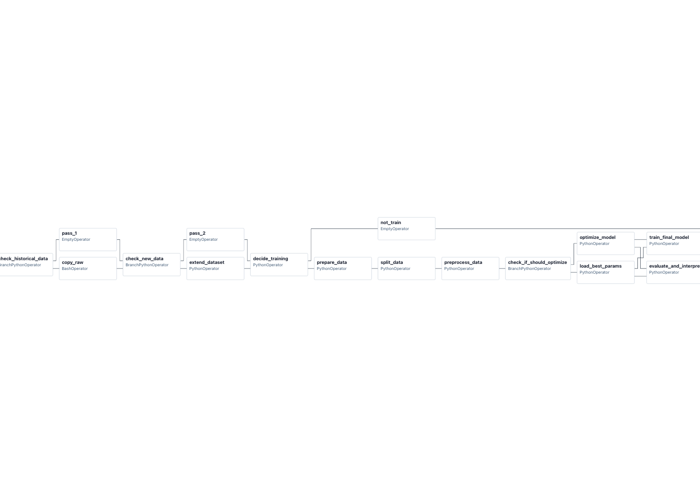

# Pipeline para predicción de productos prioritarios por semana y cliente

## Descripción del DAG

Este DAG implementa un pipeline completo para la predicción de productos prioritarios para la venta de bebestibles por cliente y semana con las siguientes tareas:

### 1. Inicio y verificación de datos históricos

1. **'start_pipeline'**: Da inicio al DAG

2. **'check_historical_data'**: Tarea de branching que revisa si existen registros históricos de transacciones.
   - Supuesto: Los datos en bruto "aparecen magicamente" en `AIRFLOW_HOME/data/raw`.
   - Si **no** existen registros históricos: Significa que es la primera vez que se ejecuta el DAG, por lo que deriva a la tarea 'copy_raw'.
   - Si existen registros históricos: Significa que el DAG se ha ejecutado antes y deriva a 'pass_1'.

3. **'copy_raw'**: Copia los datos en bruto desde `data/raw/transacciones.parquet` a `data/historical_raw/transacciones.parquet`. Solo se ejecuta la primera vez que se ejecuta el DAG.

4. **'pass_1'**: Operador vacío. Se ejecuta desde la segunda vez que se ejecuta el DAG en adelante.

### 2. Verificación e incorporación de datos nuevos

5. **'check_new_data'**: Tarea de branching que revisa si hay datos nuevos.
   - Supuesto: Los datos nuevos "aparecen" en `AIRFLOW_HOME/data/new/transacciones.parquet`.
   - Si hay datos nuevos: Deriva a 'extend_dataset'.
   - Si **no** hay datos nuevos: Deriva a 'pass_2'.

6. **'extend_dataset'**: Agrega nuevas observaciones al dataset histórico. Lee el archivo `data/new/transacciones.parquet` y concatena sus filas al archivo en `data/historical_raw/transacciones.parquet`. También establece una bandera XCom `new_data_added=True` para comunicar que se agregaron datos nuevos.

7. **'pass_2'**: Operador vacío. Se ejecuta si no hay datos nuevos.

### 3. Decisión de entrenamiento y preparación de datos

8. **'decide_training'**: Tarea de branching que revisa si es necesario ejecutar preprocesamiento de datos y entrenamiento del modelo.
   - Si 'copy_raw' **o** 'extend_dataset' se ejecutaron con éxito (es decir, si es la primera vez que se ejecuta el DAG o si hay datos nuevos): Deriva a 'prepare_data'.
   - Si **no** se ejecutó ninguno de los anteriores: Deriva a 'not_train'.

9. **'not_train'**: Operador vacío que se ejecuta si no es necesario entrenar el modelo. Deriva directamente a 'end_pipeline'.

10. **'prepare_data'**: Primer paso de la etapa de preparación de datos. Realiza las siguientes operaciones:
    - Lee datos desde `data/historical_raw/transacciones.parquet` y los archivos de clientes y productos en `data/raw/`.
    - Elimina duplicados y realiza cruces de información (merge) entre transacciones, clientes y productos.
    - Guarda catálogos únicos de clientes y productos en `data/transformed/`.
    - Realiza agregación temporal a nivel semanal (agrupa por customer_id, week, product_id).
    - Genera la variable objetivo 'priority' usando cuantiles por cliente (Very Low, Low, Medium, High, Very High).
    - Guarda el dataset preparado en `data/transformed/weekly_data.csv`.

11. **'split_data'**: Segundo paso de la etapa de preparación de datos. Genera conjuntos de entrenamiento, validación y testeo:
    - Ordena los datos por semana para preservar el orden temporal.
    - Separa el 10% final como conjunto de test (sin shuffle para mantener orden temporal).
    - Del 90% restante, separa 80% para entrenamiento y 20% para validación.
    - Guarda los splits en `data/splits/` (train.csv, val.csv, test.csv).

12. **'preprocess_data'**: Tercer y último paso de la etapa de preparación de datos. Entrena un pipeline de preprocesamiento y lo aplica a todos los conjuntos:
    - Crea un pipeline con tres transformadores en paralelo:
      - **Numéricas**: Imputación simple + escalado estándar (columnas: num_deliver_per_week, size, week).
      - **Categóricas**: Imputación por moda según tipo de cliente + codificación One-Hot (columnas: customer_type, brand, sub_category, segment, package).
      - **IDs**: Codificación mediante LabelEncoder con manejo robusto de IDs no vistos (columnas: customer_id, product_id).
    - Ajusta el pipeline en el conjunto de entrenamiento y transforma train, val y test.
    - Guarda los datos preprocesados en `data/preprocessed/`.
    - Guarda el pipeline de preprocesamiento en `models/preprocessor.joblib`.

### 4. Optimización inteligente de hiperparámetros

13. **'check_if_should_optimize'**: Tarea de branching que decide si optimizar hiperparámetros o cargar existentes. Esta decisión implementa una estrategia de optimización inteligente para reducir tiempos de ejecución:
    - Si **no** existe archivo `models/best_hyperparameters.json`: Deriva a 'optimize_model' (primera ejecución).
    - Si la variable de entorno `FORCE_REOPTIMIZE=true`: Deriva a 'optimize_model' (re-optimización forzada).
    - Si han pasado ≥ 4 semanas desde la última optimización: Deriva a 'optimize_model' (re-optimización periódica).
    - En cualquier otro caso: Deriva a 'load_best_params' (carga parámetros existentes y reentrena rápidamente).

14. **'optimize_model'**: Optimización de hiperparámetros con Optuna (ejecutado solo cuando es necesario):
    - Busca los mejores hiperparámetros para KNeighborsClassifier usando 30 trials.
    - Espacio de búsqueda: n_neighbors (5-30), weights (uniform/distance), p (1-2), leaf_size (20-40), algorithm (ball_tree/kd_tree).
    - Utiliza MedianPruner para detener trials no prometedores tempranamente.
    - Evalúa modelos usando F1-score macro en el conjunto de validación.
    - Registra cada trial en MLflow con parámetros y métricas (sin guardar el modelo para optimizar tiempo).
    - Guarda los mejores hiperparámetros en `models/best_hyperparameters.json` junto con metadata (F1-score, fecha de optimización, contador de semanas).
    - Pasa los mejores parámetros vía XCom a las tareas siguientes.

15. **'load_best_params'**: Carga de hiperparámetros existentes (ruta alternativa rápida):
    - Lee el archivo `models/best_hyperparameters.json`.
    - Muestra información de los parámetros (fecha de optimización, F1-score).
    - Incrementa el contador de semanas desde la última optimización.
    - Pasa los parámetros cargados vía XCom a las tareas siguientes.
    - Esta ruta evita la optimización completa, reduciendo el tiempo de ejecución de ~15-20 minutos a ~2-5 minutos.

### 5. Evaluación, interpretación y entrenamiento final (en paralelo)

Ambas tareas siguientes se ejecutan **en paralelo** después de cualquiera de las dos ramas anteriores (optimize_model o load_best_params), usando `trigger_rule='none_failed'`.

16. **'evaluate_and_interpret'**: Evaluación completa del modelo e interpretabilidad:
    - Obtiene los mejores hiperparámetros de XCom (ya sea de 'optimize_model' o 'load_best_params').
    - Entrena un modelo KNN con estos parámetros usando el conjunto de entrenamiento.
    - Evalúa el modelo en los tres conjuntos (train, val, test) calculando métricas: accuracy, precision, recall, F1-score macro.
    - Genera un classification report detallado.
    - Realiza análisis de interpretabilidad con SHAP:
      - Usa KernelExplainer con una muestra de 500 observaciones del conjunto de test.
      - Genera summary plot mostrando las 15 features más importantes.
    - Registra todo en MLflow (parámetros, métricas, classification report, gráficos SHAP).
    - Guarda el modelo entrenado en `models/product_priority_model_train.joblib`.

17. **'train_final_model'**: Entrenamiento del modelo final de producción:
    - Obtiene los mejores hiperparámetros de XCom (ya sea de 'optimize_model' o 'load_best_params').
    - Concatena **todos** los datos (train + val + test) para maximizar el desempeño predictivo.
    - Entrena el modelo final KNN con todos los datos disponibles.
    - Guarda el modelo en `models/product_priority_model.joblib` (este es el modelo usado para predicciones).
    - Registra el modelo en MLflow con nombre registrado 'product_priority_model'.

### 6. Finalización

18. **'end_pipeline'**: Fin del pipeline. Usa `trigger_rule='none_failed'` para ejecutarse después de cualquiera de las ramas (entrenamiento completo o salto por falta de datos nuevos).

## Diagrama de flujo del *pipeline* completo

## Representación visual del `DAG` en la interfaz de `Airflow`.

## Estructura del flujo de decisiones (4 puntos de branching)

El DAG implementa 4 puntos de decisión críticos que determinan el flujo de ejecución:

### Decisión 1: Verificación de datos históricos (check_historical_data)
- **Propósito**: Detectar si es la primera ejecución del pipeline
- **Condición**: ¿Existe `data/historical_raw/transacciones.parquet`?
  - **NO** → `copy_raw` (copiar datos iniciales)
  - **SÍ** → `pass_1` (saltar, ya existe dataset histórico)

### Decisión 2: Verificación de datos nuevos (check_new_data)
- **Propósito**: Detectar llegada de nuevos datos para reentrenamiento
- **Condición**: ¿Existe `data/new/transacciones.parquet`?
  - **SÍ** → `extend_dataset` (incorporar nuevos datos al histórico)
  - **NO** → `pass_2` (no hay datos nuevos)

### Decisión 3: Decisión de entrenamiento (decide_training)
- **Propósito**: Determinar si es necesario procesar datos y entrenar/reentrenar
- **Condición**: ¿Se ejecutó `copy_raw` O `extend_dataset` exitosamente?
  - **SÍ** → `prepare_data` (iniciar pipeline de entrenamiento completo)
  - **NO** → `not_train` (saltar a finalización, no hay cambios en datos)

### Decisión 4: Optimización inteligente (check_if_should_optimize)
- **Propósito**: Minimizar tiempo de ejecución evitando re-optimización innecesaria
- **Condiciones** (evaluadas en orden):
  1. ¿Variable de entorno `FORCE_REOPTIMIZE=true`? → `optimize_model`
  2. ¿No existe `models/best_hyperparameters.json`? → `optimize_model`
  3. ¿Han pasado ≥ 4 semanas desde última optimización? → `optimize_model`
  4. En cualquier otro caso → `load_best_params`

## Lógica de integración de nuevos datos y reentrenamiento

### Flujo de datos
1. **Datos iniciales**: Aparecen "mágicamente" en `data/raw/transacciones.parquet` antes de la primera ejecución.
2. **Primera ejecución**:
   - Se copian de `data/raw/` a `data/historical_raw/`.
   - Se ejecuta pipeline completo con optimización de hiperparámetros (30 trials, ~15-20 minutos).
   - Se guardan hiperparámetros óptimos en `models/best_hyperparameters.json`.

3. **Datos nuevos**:
   - El usuario o sistema coloca nuevos datos en `data/new/transacciones.parquet`.
   - El DAG detecta su existencia y los concatena al dataset histórico.
   - Se marca bandera `new_data_added=True` vía XCom.

4. **Reentrenamiento con datos nuevos**:
   - Se ejecuta pipeline de preparación y preprocesamiento completo.
   - **Optimización inteligente**: Se cargan hiperparámetros existentes (instantáneo) en lugar de re-optimizar.
   - Se reentrena el modelo con los nuevos datos usando parámetros ya optimizados (~2-5 minutos).
   - El modelo actualizado reemplaza al anterior en `models/product_priority_model.joblib`.
   - MLflow mantiene registro de todas las versiones.

### Estrategia de re-optimización periódica
Para mantener la relevancia de los hiperparámetros a medida que evolucionan los datos:
- **Contador de semanas**: Cada ejecución incrementa un contador en `best_hyperparameters.json`.
- **Re-optimización automática**: Al alcanzar 4 semanas, se ejecuta optimización completa nuevamente.
- **Re-optimización manual**: Configurando `export FORCE_REOPTIMIZE=true` antes de triggear el DAG.
- **Reinicio del contador**: Tras cada optimización, el contador vuelve a 0.

### Detección de drift (implícita)
Aunque no se implementa detección estadística de drift, la estrategia de re-optimización periódica sirve como mecanismo preventivo:
- Cada 4 semanas se re-evalúa el espacio de hiperparámetros con los datos más recientes.
- Esto permite que el modelo se adapte gradualmente a cambios en la distribución de datos.
- Las métricas de evaluación en MLflow permiten comparar el desempeño entre versiones para detectar degradación.

### Ventajas del diseño
- **Eficiencia**: Reduce tiempo de reentrenamiento semanal de ~20 min a ~5 min (75% más rápido).
- **Flexibilidad**: Permite forzar re-optimización cuando se detecten cambios significativos.
- **Trazabilidad**: MLflow registra todas las versiones del modelo y sus métricas.
- **Escalabilidad**: El dataset histórico crece incrementalmente sin límite de tamaño.
- **Robustez**: Manejo de múltiples escenarios (primera vez, datos nuevos, sin cambios, re-optimización).

## Configuración del DAG

- **dag_id**: `product_purchase_prediction`
- **schedule**: `@weekly` (ejecución automática semanal)
- **start_date**: 31 de diciembre de 2024
- **catchup**: `False` (sin backfill de ejecuciones pasadas)
- **retries**: 1 intento adicional en caso de fallo
- **retry_delay**: 5 minutos

## Archivos generados por el pipeline

| Ruta | Descripción |
|------|-------------|
| `data/historical_raw/transacciones.parquet` | Dataset histórico completo (se actualiza con nuevos datos) |
| `data/transformed/weekly_data.csv` | Datos agregados semanalmente con variable objetivo |
| `data/transformed/unique_clients.csv` | Catálogo de clientes únicos |
| `data/transformed/unique_products.csv` | Catálogo de productos únicos |
| `data/splits/train.csv` | Conjunto de entrenamiento (72% de datos) |
| `data/splits/val.csv` | Conjunto de validación (18% de datos) |
| `data/splits/test.csv` | Conjunto de prueba (10% de datos) |
| `data/preprocessed/train.csv` | Datos de entrenamiento preprocesados |
| `data/preprocessed/val.csv` | Datos de validación preprocesados |
| `data/preprocessed/test.csv` | Datos de prueba preprocesados |
| `models/preprocessor.joblib` | Pipeline de preprocesamiento entrenado |
| `models/best_hyperparameters.json` | Hiperparámetros óptimos y metadata de optimización |
| `models/product_priority_model_train.joblib` | Modelo entrenado solo con datos de train (para evaluación) |
| `models/product_priority_model.joblib` | Modelo final de producción (entrenado con todos los datos) |

## Registro en MLflow

El pipeline registra tres tipos de experimentos en MLflow:

1. **`{model_name}_optimization_{execution_date}`**: Registra cada trial de optimización con Optuna
   - Parámetros probados (n_neighbors, weights, p, leaf_size, algorithm)
   - F1-score de validación

2. **`Model_Evaluation_and_Interpretation`**: Registra evaluación completa del modelo
   - Hiperparámetros óptimos
   - Métricas en train, val y test (accuracy, precision, recall, F1)
   - Classification report
   - Gráficos SHAP de interpretabilidad
   - Modelo entrenado con datos de train

3. **`Final_Model`**: Registra modelo final de producción
   - Modelo entrenado con todos los datos
   - Nombre registrado: `product_priority_model`
