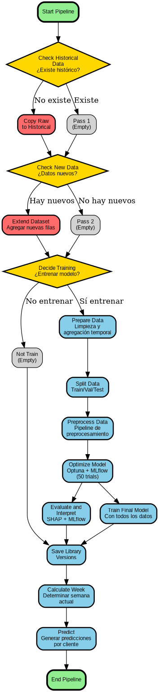

# Pipeline para predicción de productos prioritarios por semana y cliente

## Descripción del DAG

Este DAG implementa un pipeline completo para la predicción de productos prioritarios para la venta de bebestibles por cliente y semana con las siguientes tareas:

1. 'start_pipeline': Da inicio al DAG

2. 'check_historical_data': Tarea de branching, que revisa si existen registros históricos de transacciones. Supuesto: Los datos en bruto "aparecen magicamente" en AIRFLOW_HOME/data/raw.
  - Si no existen registros históricos: Significa que es primera vez que se ejecuta el DAG, por lo que deriva a la tarea 'copiar raw'.
  - Si existen registros históricos: Significa que el DAG se ha ejecutado antes y deriva a 'pass_1'.

3. 'copy_raw': Esta tarea copia los datos en bruto a AIRFLOW_HOME/data/historical_raw. Solo se ejecuta la primera vez que se ejecuta el dag.

4. 'pass_1': Operador vacío. Se ejecuta desde la segunda vez que se ejecuta el DAG en adelante.

5. 'check_new_data':  Tarea de branching que revisa si hay datos nuevos. Supuesto: estos "aparecen" en AIRFLOW_HOME/data/new.
  - Si hay datos nevos: Deriva a 'extend_dataset'.
  - Si no hay datos nuevos: Deriva a 'pass_2'.

6. 'extend_dataset': Agrega nuevas observaciones al dataset historico. Es decir, agrega la información del archivo transacciones.parquet en AIRFLOW_HOME/data/new en el archivo localizado en AIRFLOW_HOME/data/historical_raw.

7. 'pass_2': No hace nada. Se ejecuta si no hay datos nuevos.

8. 'decide_training': Tarea de branching que revisa si es necesario ejecutar preprocesamiento de datos y entrenamiento del modelo.
  - Si 'copy_raw' o 'extend_dataset' se ejecutaron con éxito, es decir, si es la primera vez que se ejecuta el DAG o si hay datos nuevos, deriva en 'prepare_data', que es el primer paso del preprocesamiento de datos.
  - Si no se ejecutó 'copy_raw' ni 'extend_dataset', deriva en 'not_train'

9. 'not_train': Operador vacío que se ejecuta si no es necesario entrenar el modelo, deriva en 'save_library_versions'

10. 'prepare_data': Primer paso de la etapa de preparación de datos. Hace una limpieza inicial y realiza la agregación temporal, generando la variable objetivo "Priority".

11. 'split_data': Segundo paso de la etapa de preparación de datos. Genera conjuntos de entrenamiento, validación y testeo.

12. 'preprocess_data': Tercer y último paso de la etapa de preparación de datos. Entrena un pipeline preprocesamiento en el conjunto de entrenamiento y lo aplica a todos los conjuntos. Deriva en 'optimize model'.

13. 'optimize_model': Primer paso de la etapa de modelado. Realiza optimización de parámetros con optuna y registra en MLFlow, usando datos de entrenamiento y validación.

14. 'evaluate_and_interpret': Segundo paso de la etapa de modelado. Entrena un modelo con el conjunto de entrenamiento usando los parámetros encontrados en 'optimize_model'. Evalúa el modelo en todos los conjuntos y realiza análisis de interpretabilidad con SHAP, registrando todo con MLFlow.

15. 'train_final_model': Tercer y ultimo paso de la etapa de modelado. En paralelo a 'evaluate_and_interpret', entrena el modelo final que será usado para predecir, usando los parámetros encontrados en 'optimize_model'. Usa todos los datos (junta train + val + test) para mejorar el desempeño predictivo. Deriva en 'save_library_versions'. 
  
16. 'save_library_versions': Guarda las versiones de las librerías, independiente de si se realizó entrenamiento o no. Deriva en 'calculate_week'.

17. 'calculate_week': calcula el número correspondiente a la "proxima semana" para obtener la prediccion para la proxima semana. Deriva en 'predict'

18. 'predict': Realiza la prediccion para la proxima semana

17. 'end_pipeline': Fin del pipeline.

## Diagrama de flujo del *pipeline* completo

## Una representación visual del `DAG` en la interfaz de `Airflow`.

## Explicación de cómo se diseñó la lógica para integrar futuros datos, detectar *drift* y reentrenar el modelo.
Se asume que los nuevos datos "aparecerán" (ya sea "magicamente" o porque el usuario los pegó ahi) en AIRFLOW_HOME/data/new, en un archivo llamado 'transacciones.parquet', que sigue el mismo formato del archivo original. Al inicio del pipeline, se detecta si este archivo existe, en cuyo caso lo lee y agrega sus filas al archivo 'transacciones.parquet' localizado en AIRFLOW_HOME/data/historical_new. Este último es el que siempre se utiliza para el modelado.

Se entrena el modelo si es la primera vez que se ejecuta el pipeline o si hay datos nuevos. En el segundo caso, el modelo entrenado (o reentrenado) reemplaza al anterior, aunque MLFlow mantiene registro de todas las versiones.